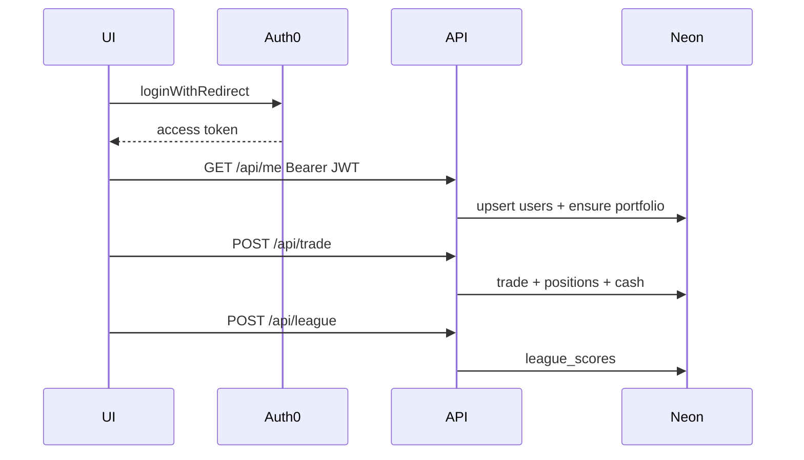
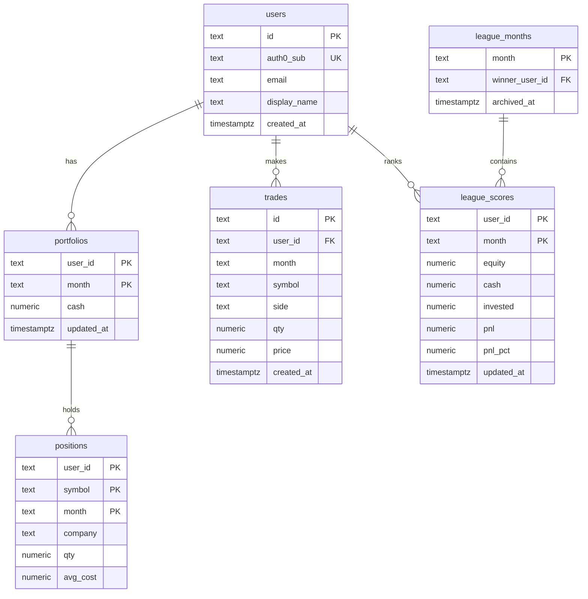

# Erick Stocks — Market Simulator

Demo de **trading simulado** con cotizaciones US en vivo (Finnhub), cuentas **Auth0**, y persistencia real en **Neon Postgres** (users, trades, portfolio y liga mensual).

Por [Erick Vargas](https://github.com/erickorso) · Live: [erick-market-2025.vercel.app](https://erick-market-2025.vercel.app)

> Demo educativo — no es consejo financiero ni un broker real.

---

## Decisiones de producto

| Tema | Decisión |
|------|----------|
| **DB** | [Neon](https://neon.tech) Postgres |
| **Auth** | Auth0 (SPA Vite + JWT en API Vercel) |
| **Público** | Home, Hot, detalle, quotes |
| **Privado (Auth0)** | buy / sell, portfolio (`/my-stocks`, `/my-fund`), Play / liga |
| **UX buy/sell** | Botones **visibles pero disabled** sin sesión + mensaje/CTA login (no se ocultan) |
| **Nav portfolio** | Links *Mis acciones* / *Mi fondo* solo si hay sesión |
| **UI** | Dark/light mode, i18n EN/ES, scroll solo en la columna central |

---

## Arquitectura

```text
Browser (Vite SPA + Auth0 + UserProvider)
   │  público:  GET /api/quotes | /api/hot | /api/detail
   │  privado:  /api/me | /api/portfolio | /api/trade | POST /api/league
   ▼
Vercel serverless (withAuth middleware)
   ├── Finnhub (+ Yahoo charts fallback)
   └── Neon Postgres
```

### Capas de auth

| Capa | Qué hace |
|------|----------|
| **API `withAuth()`** | [`api/_lib/middleware.ts`](api/_lib/middleware.ts) — CORS, JWT Auth0, upsert user en Neon |
| **Cliente** | `AuthProvider` → `UserProvider` (`useUser()`) — identidad Auth0 + `profile` / `portfolio` Neon |
| **Rutas** | `protectedRoute(<Page />)` en Play, portfolio y sell |



---

## Modelo de datos (Neon)

Fuente de verdad: [`db/schema.sql`](db/schema.sql).



### Tablas

| Tabla | Rol |
|-------|-----|
| **users** | Perfil interno; `auth0_sub` = `sub` del JWT |
| **portfolios** | Cash por usuario y mes (`YYYY-MM`) |
| **positions** | Holdings (qty + avg cost) por símbolo/mes |
| **trades** | Ledger de buy/sell |
| **league_scores** | Ranking MTM del mes |
| **league_months** | Archivo del mes + `winner_user_id` |

### Reglas de negocio

- Mes = `YYYY-MM`. Al primer acceso del mes nuevo → portfolio con **$10,000** de cash.
- Trades actualizan `positions` + `cash` en la misma operación.
- Al cambiar de mes se archiva el ganador (mayor equity) en `league_months`.
- Buy/sell siguen siendo **simulados** (no hay broker real).

---

## Mercado (público)

| Feature | Detalle |
|---------|---------|
| Quotes | `GET /api/quotes?limit=&offset=&q=&category=` → Finnhub |
| Hot | Sidebar top gainers; local WS `/ws/hot` o poll `/api/hot` |
| Detail | Modal → `/api/detail?symbol=` (quote + profile + candles Yahoo/Finnhub) |
| Categorías | Tags educativas + day gainers/losers |

Sin `FINNHUB_API_KEY` la UI cae a mock (ticks simulados).

---

## Setup

### 1. Neon — https://neon.tech

1. Create project (ej. `erick-market`).
2. Copiá la **connection string** → `DATABASE_URL`.
3. Aplicá el schema (una vez):

```bash
psql "$DATABASE_URL" -f db/schema.sql
```

Sin `psql`: Neon → **SQL Editor** → pegá [`db/schema.sql`](db/schema.sql) → Run.

### 2. Auth0

1. **Application** → tipo *Single Page Application*.
2. **API** → Identifier = audience (ej. `https://erick-market-api`).
3. En la App:
   - Allowed Callback URLs: `http://localhost:5173`, `https://erick-market-2025.vercel.app`
   - Allowed Logout URLs: igual
   - Allowed Web Origins: igual
4. Completá `.env` (ver [`.env.example`](.env.example)):

| Variable | Uso |
|----------|-----|
| `AUTH0_DOMAIN` / `VITE_AUTH0_DOMAIN` | Tenant Auth0 |
| `VITE_AUTH0_CLIENT_ID` | SPA Client ID |
| `AUTH0_AUDIENCE` / `VITE_AUTH0_AUDIENCE` | API Identifier |

### 3. Local

```bash
cp .env.example .env
# FINNHUB_API_KEY, DATABASE_URL, AUTH0_*, VITE_AUTH0_*
npm install
npm run dev:api   # :4010 — quotes + auth APIs
npm run dev       # Vite proxy /api → :4010
```

### 4. Vercel

Env (Production + Preview):

- `FINNHUB_API_KEY`
- `DATABASE_URL`
- `AUTH0_DOMAIN`, `AUTH0_AUDIENCE`
- `VITE_AUTH0_DOMAIN`, `VITE_AUTH0_CLIENT_ID`, `VITE_AUTH0_AUDIENCE`

Redeploy tras cambiar `VITE_*` (se embeben en el build).

---

## Scripts

| Command | Qué hace |
|---------|----------|
| `npm run dev` | Frontend Vite |
| `npm run dev:api` | BFF local (:4010) |
| `npm run build` | typecheck + Vite build |
| `npm run typecheck` | `tsc --noEmit` |
| `npm run db:schema` | Hint para aplicar el SQL |

---

## Stack

React 19 · TypeScript · Vite · Tailwind · Recharts · Three.js · Auth0 · Neon · Finnhub · Vercel serverless

## Licencia

MIT · © Erick Vargas Ramos
