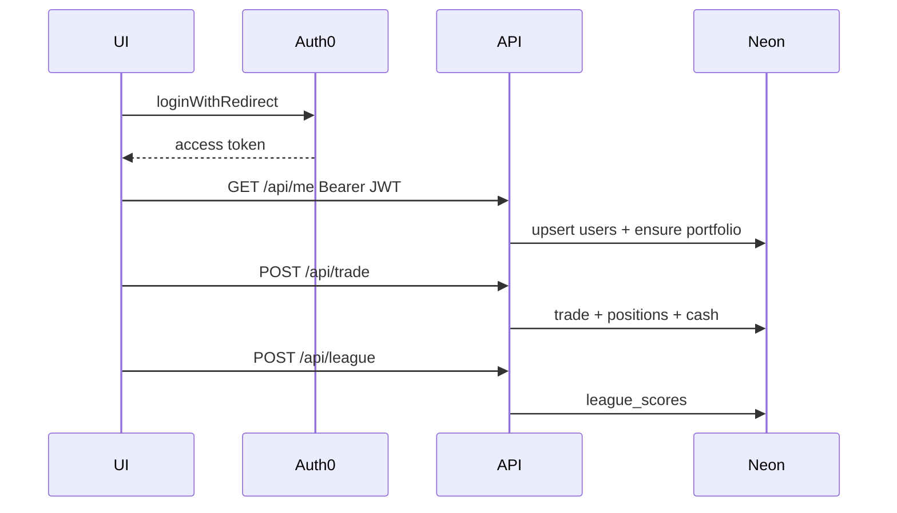
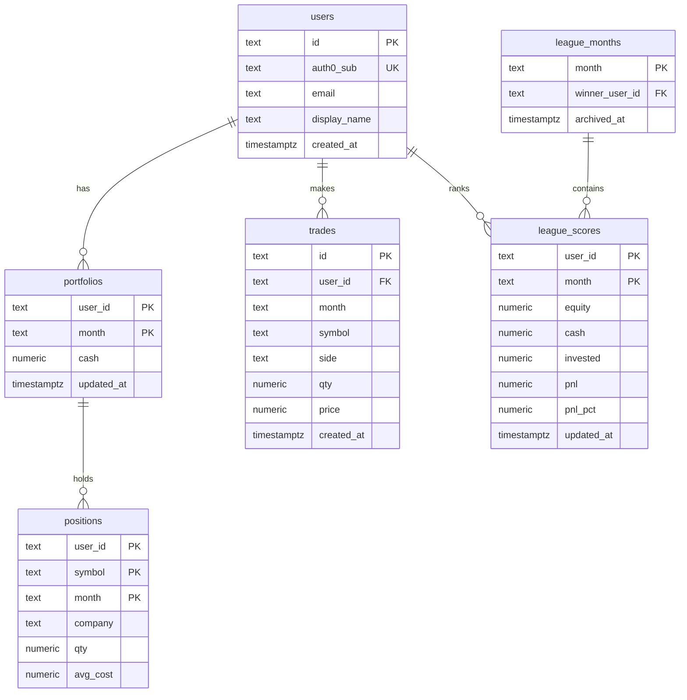

# Erick Stocks — Market Simulator

**Paper trading** demo with live US quotes (Finnhub), **Auth0** accounts, and real persistence on **Neon Postgres** (users, trades, portfolio, and monthly league).

By [Erick Vargas](https://github.com/erickorso) · Live: [erick-market-2025.vercel.app](https://erick-market-2025.vercel.app)

> Educational demo — not financial advice and not a real broker.

---

## Product decisions

| Topic | Decision |
|------|----------|
| **DB** | [Neon](https://neon.tech) Postgres |
| **Auth** | Auth0 (Vite SPA + JWT on Vercel API) |
| **Public** | Home, Hot, detail, quotes |
| **Private (Auth0)** | buy / sell, portfolio (`/my-stocks`, `/my-fund`), Play / league |
| **Buy/sell UX** | Buttons stay **visible but disabled** when logged out + login CTA (not hidden) |
| **Portfolio nav** | *My Stocks* / *My Fund* links only when authenticated |
| **UI** | Dark/light mode, i18n EN/ES, scroll only in the center column |

---

## Architecture

```text
Browser (Vite SPA + Auth0 + UserProvider)
   │  public:   GET /api/quotes | /api/hot | /api/detail
   │  private:  /api/me | /api/portfolio | /api/trade | POST /api/league
   ▼
Vercel serverless (withAuth middleware)
  ├── Finnhub (+ Yahoo charts fallback)
   └── Neon Postgres
```

The frontend keeps the 3D market background behind a lazy-loaded boundary, so
the initial page can render without loading the Three.js scene up front. Vite
also splits framework, authentication, and charting dependencies into separate
chunks to keep the main entrypoint small.

### Auth layers

| Layer | Role |
|------|------|
| **API `withAuth()`** | [`api/_lib/middleware.ts`](api/_lib/middleware.ts) — CORS, Auth0 JWT, upsert user in Neon |
| **Client** | `AuthProvider` → `UserProvider` (`useUser()`) — Auth0 identity + Neon `profile` / `portfolio` |
| **Routes** | `protectedRoute(<Page />)` on Play, portfolio, and sell |



---

## Data model (Neon)

Source of truth: [`db/schema.sql`](db/schema.sql).



### Tables

| Table | Role |
|-------|------|
| **users** | Internal profile; `auth0_sub` = JWT `sub` |
| **portfolios** | Cash per user and month (`YYYY-MM`) |
| **positions** | Holdings (qty + avg cost) per symbol/month |
| **trades** | Buy/sell ledger |
| **league_scores** | Monthly mark-to-market ranking |
| **league_months** | Month archive + `winner_user_id` |

### Business rules

- Month = `YYYY-MM`. First access in a new month → portfolio with **$10,000** cash.
- Trades update `positions` + `cash` + the trade ledger in one SQL CTE statement,
  preventing partial updates when funds or holdings are insufficient.
- Trade input is validated server-side, including side, symbol format, finite
  positive quantity, finite positive price, and reasonable upper bounds.
- On month rollover, the highest equity is archived as winner in `league_months`.
- Buy/sell remain **simulated** (no real broker).

### League scoring

Ranking is continuous **mark-to-market** for the current month (not a daily cron):

```text
equity  = cash + positions at live prices
pnl     = equity − $10,000
pnl_%   = pnl / 10,000 × 100
```

Scores upsert after trades / price changes (~1s debounce) via `POST /api/league`.
The request body is ignored for scoring: the API recalculates the score from the
authenticated user's stored portfolio and live prices. The Top 10 sidebar polls
the board about every 60s.

---

## Market (public)

| Feature | Detail |
|---------|--------|
| Quotes | `GET /api/quotes?limit=&offset=&q=&category=` → Finnhub |
| Hot | Sidebar top gainers; local WS `/ws/hot` or poll `/api/hot` |
| Detail | Modal → `/api/detail?symbol=` (quote + profile + Yahoo/Finnhub candles) |
| Categories | Educational tags + day gainers/losers |

Without `FINNHUB_API_KEY` the UI falls back to mock (simulated ticks).

---

## Setup

### 1. Neon — https://neon.tech

1. Create a project (e.g. `erick-market`).
2. Copy the **connection string** → `DATABASE_URL`.
3. Apply the schema once:

```bash
psql "$DATABASE_URL" -f db/schema.sql
```

No `psql`: Neon → **SQL Editor** → paste [`db/schema.sql`](db/schema.sql) → Run.

### 2. Auth0

1. **Application** → type *Single Page Application*.
2. **API** → Identifier = audience (e.g. `https://erick-market-api`).
3. On the App:
   - Allowed Callback URLs: `http://localhost:5173`, `https://erick-market-2025.vercel.app`
   - Allowed Logout URLs: same
   - Allowed Web Origins: same
4. Fill `.env` (see [`.env.example`](.env.example)):

| Variable | Use |
|----------|-----|
| `AUTH0_DOMAIN` / `VITE_AUTH0_DOMAIN` | Auth0 tenant |
| `VITE_AUTH0_CLIENT_ID` | SPA Client ID |
| `AUTH0_AUDIENCE` / `VITE_AUTH0_AUDIENCE` | API Identifier |

### 3. Local

```bash
cp .env.example .env
# FINNHUB_API_KEY, DATABASE_URL, AUTH0_*, VITE_AUTH0_*
npm install
npm run dev:api   # :4010 — quotes + auth APIs
npm run dev       # Vite proxies /api → :4010
```

For a frontend-only run, `npm run dev` is enough when using the mock market
fallback. Authenticated persistence and live API routes require the local API,
database, and Auth0 variables above.

### 4. Vercel

Env (Production + Preview):

- `FINNHUB_API_KEY`
- `DATABASE_URL`
- `AUTH0_DOMAIN`, `AUTH0_AUDIENCE`
- `VITE_AUTH0_DOMAIN`, `VITE_AUTH0_CLIENT_ID`, `VITE_AUTH0_AUDIENCE`

Redeploy after changing `VITE_*` (they are baked into the build).

---

## Scripts

| Command | What it does |
|---------|--------------|
| `npm run dev` | Vite frontend |
| `npm run dev:api` | Local BFF (:4010) |
| `npm run build` | typecheck + Vite build |
| `npm run typecheck` | `tsc --noEmit` |
| `npm test` | Run Vitest unit tests once |
| `npm run test:integration` | Run Neon integration tests with `DATABASE_URL_TEST` |
| `npm run test:watch` | Run Vitest in watch mode |
| `npm run test:e2e` | Run Playwright end-to-end tests |
| `npm run test:e2e:ui` | Open Playwright UI mode |
| `npm run db:schema` | Hint to apply the SQL |

---

## Stack

React 19 · TypeScript · Vite · Tailwind · Recharts · Three.js · Vitest · Auth0 · Neon · Finnhub · Vercel serverless

## Quality checks

The current unit tests cover trade input validation and mark-to-market equity
calculations in [`api/_lib/tradeValidation.test.ts`](api/_lib/tradeValidation.test.ts).
Run the full local verification with:

```bash
npm test
npm run typecheck
npm run build
npm run test:e2e
```

The E2E suite uses deterministic mocked market responses and runs against the
local Vite server, so it does not require Auth0, Finnhub, or Neon credentials.
It includes an isolated Auth0-compatible development provider enabled only by
Playwright through `VITE_E2E_AUTH=true`. The setup project generates
`playwright/.auth/e2e.json` as a local `storageState`; it contains only the
synthetic E2E session and is ignored by Git. No Google login or credentials are
automated. Install the Chromium browser once with
`npx playwright install chromium`.

Integration tests use a separate Neon branch or project through
`DATABASE_URL_TEST`. Apply the schema there before running them:

```bash
psql "$DATABASE_URL_TEST" -f db/schema.sql
npm run test:integration
```

The integration suite creates a unique test user, cleans only that user's rows,
and verifies atomic trade behavior, including concurrent purchases. It never
uses `DATABASE_URL` from production when `DATABASE_URL_TEST` is missing.

## License

MIT · © Erick Vargas Ramos
