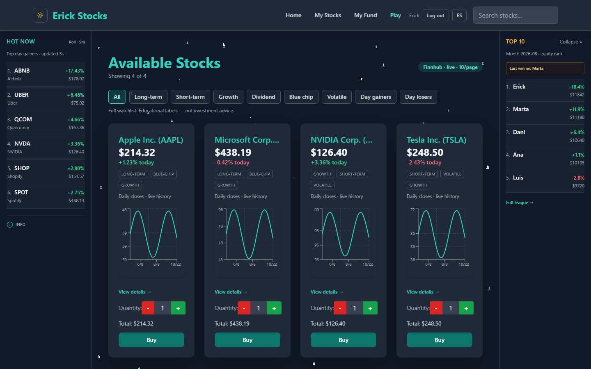
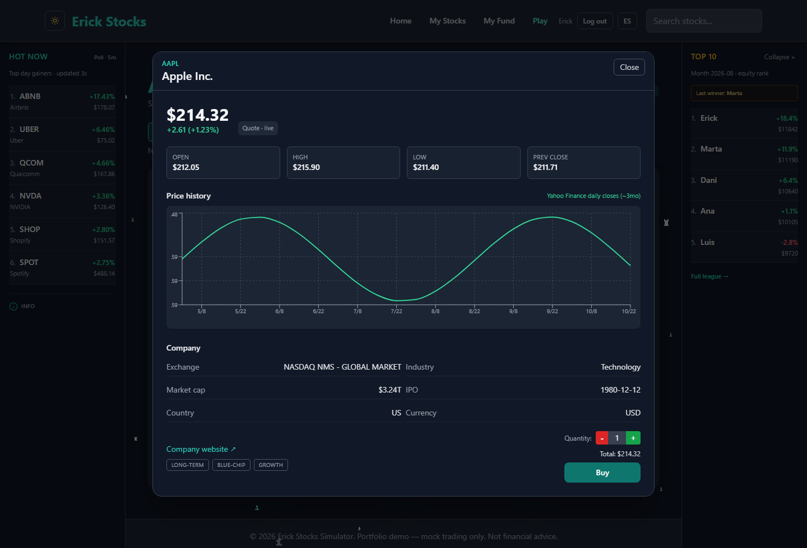
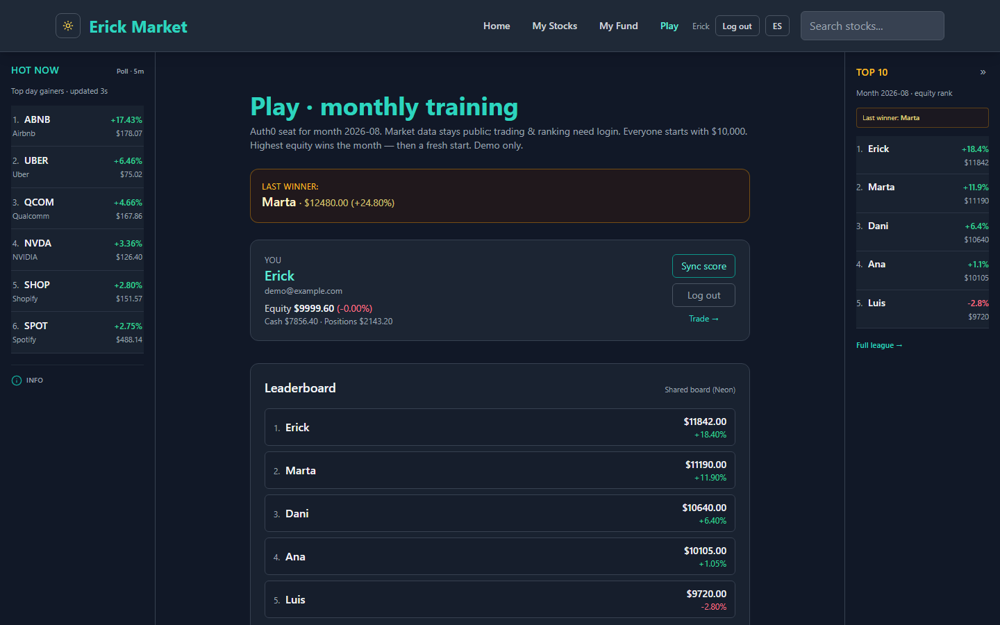
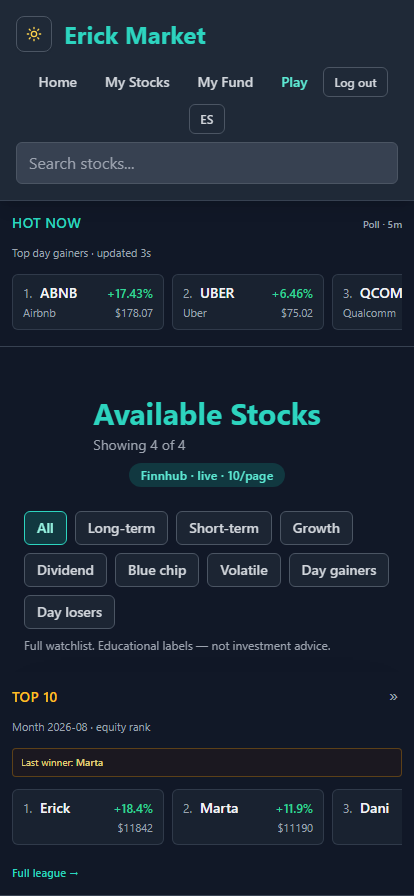
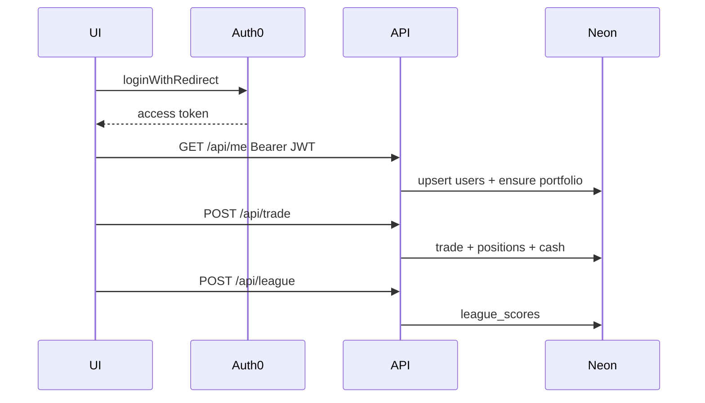
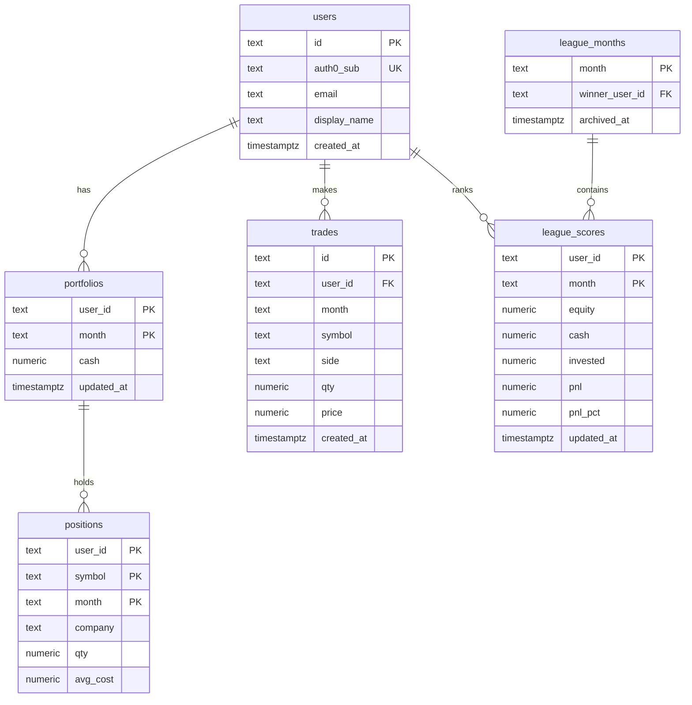

# Erick Stocks — Market Simulator

[](https://github.com/erickorso/erick-market-2025/actions/workflows/ci.yml)

**Paper trading** demo with live US quotes (Finnhub), **Auth0** accounts, and real persistence on **Neon Postgres** (users, trades, portfolio, and monthly league).

By [Erick Vargas](https://github.com/erickorso) · Live: [erick-market-2025.vercel.app](https://erick-market-2025.vercel.app)

> Educational demo — not financial advice and not a real broker.



<table>
<tr>
<td width="50%">

**Stock detail** — live quote, session figures, Yahoo daily closes, and the buy panel.



</td>
<td width="50%">

**Monthly league** — mark-to-market ranking that resets every month.



</td>
</tr>
</table>



Screenshots are generated by `npm run screenshots`, a Playwright project that
drives the real app against the same deterministic mocks as the e2e suite — so
they cannot drift from the UI.

---

## Product decisions

| Topic               | Decision                                                                       |
| ------------------- | ------------------------------------------------------------------------------ |
| **DB**              | [Neon](https://neon.tech) Postgres                                             |
| **Auth**            | Auth0 (Vite SPA + JWT on Vercel API)                                           |
| **Public**          | Home, Hot, detail, quotes                                                      |
| **Private (Auth0)** | buy / sell, portfolio (`/my-stocks`, `/my-fund`), Play / league                |
| **Buy/sell UX**     | Buttons stay **visible but disabled** when logged out + login CTA (not hidden) |
| **Portfolio nav**   | _My Stocks_ / _My Fund_ links only when authenticated                          |
| **UI**              | Dark/light mode, i18n EN/ES, scroll only in the center column                  |

---

## Architecture

```text
Browser (Vite SPA + Auth0 + UserProvider)
   │  public:   GET /api/quotes | /api/hot | /api/detail
   │  private:  /api/me | /api/portfolio | /api/trade | POST /api/league
   ▼
Vercel serverless (withAuth middleware)
  ├── Finnhub (+ Yahoo charts fallback)
   └── Neon Postgres
```

The frontend keeps the 3D market background behind a lazy-loaded boundary, so
the initial page can render without loading the Three.js scene up front. Vite
also splits framework, authentication, and charting dependencies into separate
chunks to keep the main entrypoint small.

### Frontend layers

Components follow atomic design, and no component owns domain logic — that
lives in hooks, so it can be tested without rendering anything.

```text
components/
  atoms/       Chart · Badge · Price · ChangePercent · Skeleton
  molecules/   TradePanel · QuantityStepper · StatCard · TagList · ChartPanel
               ComicTooltip · DetailSkeleton · Hot/Rank/StockListItem
  organisms/   StockCard · StockDetailModal · StockGrid · HotSidebar
               RankSidebar · Navbar · SellStockForm · CategoryFilter
               NoticeBanner · MarketBackground · ErrorBoundary
  templates/   AppShell
  routing/     RequireAuth
pages/         Home · League · MyStocks · MyFund
```

| Hook                                                | Owns                                                                 |
| --------------------------------------------------- | -------------------------------------------------------------------- |
| [`useStockCatalog`](hooks/useStockCatalog.ts)       | initial load, paging, debounced search, the tick and live-poll loops |
| [`useTrading`](hooks/useTrading.ts)                 | portfolio hydration and buy/sell through one guarded path            |
| [`useStockDetail`](hooks/useStockDetail.ts)         | detail fetch + live quote overlay (no refetch on price polls)        |
| [`useTradePanel`](hooks/useTradePanel.ts)           | quantity, affordability, guarded submit — shared by card and modal   |
| [`useSellForm`](hooks/useSellForm.ts)               | position lookup and sell validation                                  |
| [`useQueryFilters`](hooks/useQueryFilters.ts)       | filters ↔ URL, so any view is linkable                               |
| [`useFocusTrap`](hooks/useFocusTrap.ts)             | dialog focus containment and restore                                 |
| [`useInertBackground`](hooks/useInertBackground.ts) | marking the page behind an overlay inert                             |
| [`useReducedMotion`](hooks/useReducedMotion.ts)     | whether to animate at all                                            |
| [`useHotStocks`](hooks/useHotStocks.ts)             | hot-gainers socket with poll fallback                                |

[`StockContext`](context/StockContext.tsx) is only a composition root; the state
transitions live in [`stockReducer`](context/stockReducer.ts) as a pure,
directly testable function.

### Resilience

`ErrorBoundary` is mounted at three depths so one failure degrades rather than
blanking the page: the root, the routed centre column, and inline around the
Three.js background (falls back to nothing) and the recharts panels (fall back
to a label). A route change clears the fallback, so a transient failure does
not strand the user until they reload.

### Accessibility

Held to **WCAG 2.1 AA**, and enforced rather than asserted: axe runs over
components in the unit suite and over the assembled pages in
[`e2e/a11y.spec.ts`](e2e/a11y.spec.ts) — dark and light, desktop and mobile,
with the detail modal open. The scan is what surfaced most of what follows.

| Concern      | How                                                                                                                                                                                                                                                          |
| ------------ | ------------------------------------------------------------------------------------------------------------------------------------------------------------------------------------------------------------------------------------------------------------ |
| **Contrast** | Every muted, semantic and CTA colour has a light-mode counterpart. The app was built dark-first and reused dark-only colours on white: `text-gray-500` on the dark panels measured 4.0:1, and white on `bg-teal-500` — the Buy button — measured **2.48:1**. |
| **Modal**    | Focus is trapped, returned to whatever opened it, and the rest of the page is marked `inert` + `aria-hidden`. `aria-modal` alone does not stop virtual-cursor browsing behind a dialog.                                                                      |
| **Keyboard** | A skip link is the first tab stop, jumping the nav and both sidebars straight to `<main>`.                                                                                                                                                                   |
| **Motion**   | `prefers-reduced-motion` skips the Three.js scene entirely — which also spares that visitor the ~475 kB chunk — stops the chart replaying its draw animation, and gates the pulse and spinner behind `motion-safe:`.                                         |

### Observability

Client and server emit the same thing: one structured JSON line per event on
stdout, which is where Vercel's log drains pick them up. That makes production
failures greppable without signing up for anything, and pointing the stream at
Sentry later is a drain setting rather than a code change.

- **Server** — [`logger.ts`](api/_lib/logger.ts) logs route, status, duration,
  request id and a hashed client per request. No raw IP is ever written.
- **Client** — [`reporter.ts`](services/reporter.ts) batches errors and vitals
  and ships them to [`/api/log`](api/log.ts) with `sendBeacon`, which survives
  the tab closing. Identical events fold into one with a `count`, and a session
  is capped at 50, so a render loop throwing every frame cannot flood the
  drain. A session id correlates every event from one page load.
- **Field performance** — [`vitals.ts`](services/vitals.ts) reports TTFB, FCP,
  LCP, CLS and INP from real visitors, batched with everything else.
- **The endpoint treats the browser as untrusted**: shape and size validation,
  a 20-event cap per batch, 4 kB stacks, and a tighter 30 req/min limit than
  the read routes.

Swapping in a third party is one line in `index.tsx`:
`setErrorSink(e => Sentry.captureException(e))`.

### Auth layers

| Layer                | Role                                                                                          |
| -------------------- | --------------------------------------------------------------------------------------------- |
| **API `withAuth()`** | [`api/_lib/middleware.ts`](api/_lib/middleware.ts) — CORS, Auth0 JWT, upsert user in Neon     |
| **Client**           | `AuthProvider` → `UserProvider` (`useUser()`) — Auth0 identity + Neon `profile` / `portfolio` |
| **Routes**           | `protectedRoute(<Page />)` on Play, portfolio, and sell                                       |



---

## Data model (Neon)

Source of truth: [`db/schema.sql`](db/schema.sql).



### Tables

| Table             | Role                                       |
| ----------------- | ------------------------------------------ |
| **users**         | Internal profile; `auth0_sub` = JWT `sub`  |
| **portfolios**    | Cash per user and month (`YYYY-MM`)        |
| **positions**     | Holdings (qty + avg cost) per symbol/month |
| **trades**        | Buy/sell ledger                            |
| **league_scores** | Monthly mark-to-market ranking             |
| **league_months** | Month archive + `winner_user_id`           |

### Business rules

- Month = `YYYY-MM`. First access in a new month → portfolio with **$10,000** cash.
- Trades update `positions` + `cash` + the trade ledger in one SQL CTE statement,
  preventing partial updates when funds or holdings are insufficient.
- Trade input is validated server-side, including side, symbol format, finite
  positive quantity, finite positive price, and reasonable upper bounds.
- On month rollover, the highest equity is archived as winner in `league_months`.
- Buy/sell remain **simulated** (no real broker).

### League scoring

Ranking is continuous **mark-to-market** for the current month (not a daily cron):

```text
equity  = cash + positions at live prices
pnl     = equity − $10,000
pnl_%   = pnl / 10,000 × 100
```

Scores upsert after trades / price changes (~1s debounce) via `POST /api/league`.
The request body is ignored for scoring: the API recalculates the score from the
authenticated user's stored portfolio and live prices. The Top 10 sidebar polls
the board about every 60s.

---

## Market (public)

| Feature    | Detail                                                                                              |
| ---------- | --------------------------------------------------------------------------------------------------- |
| Quotes     | `GET /api/quotes?limit=&offset=&q=&category=` → Finnhub, up to 500 US common stocks with pagination |
| Hot        | Sidebar top gainers; local WS `/ws/hot` or poll `/api/hot`                                          |
| Detail     | Modal → `/api/detail?symbol=` (quote + profile + Yahoo/Finnhub candles)                             |
| Categories | Educational tags + day gainers/losers                                                               |

### Public API hardening

| Concern        | How                                                                                                                                                                                                                                                                  |
| -------------- | -------------------------------------------------------------------------------------------------------------------------------------------------------------------------------------------------------------------------------------------------------------------- |
| **CORS**       | Allowlist, not `*`: production, localhost, this project's Vercel preview URLs, plus anything in `ALLOWED_ORIGINS`. Always sends `Vary: Origin`.                                                                                                                      |
| **CDN cache**  | `s-maxage` 20s on `/api/quotes`, 60s on `/api/hot`, 300s on `/api/detail`, each with a `stale-while-revalidate` tail. This is what actually protects the Finnhub quota — repeats are served by the edge and never reach the function.                                |
| **Rate limit** | Sliding window per client IP, 120 req/min public and 60 authed, answering `429` with `Retry-After` and `X-RateLimit-*`. In-process, so it bounds one client against one instance rather than enforcing a global limit — see [`rateLimit.ts`](api/_lib/rateLimit.ts). |
| **Logging**    | One JSON line per request with route, status, duration and a hashed client id, on stdout where Vercel's drains pick it up.                                                                                                                                           |

`api/quotes.ts`, `api/hot.ts` and `api/detail.ts` carry an inlined copy of that
guard: their headers document that relative imports crash Vercel's ESM cold
start, which is the same reason the watchlist is duplicated there.

Without `FINNHUB_API_KEY` the UI falls back to mock (simulated ticks).
The `All` catalog discovers and caches up to 500 US common stocks from Finnhub
for six hours. Only the visible page is quoted, with a maximum concurrency of
five requests. If symbol discovery is unavailable, the API safely falls back
to the curated 40-company watchlist; individual quote failures are shown with
the mock quote label instead of removing the company from the page.

---

## Setup

### 1. Neon — https://neon.tech

1. Create a project (e.g. `erick-market`).
2. Copy the **connection string** → `DATABASE_URL`.
3. Apply the schema once:

```bash
psql "$DATABASE_URL" -f db/schema.sql
```

No `psql`: Neon → **SQL Editor** → paste [`db/schema.sql`](db/schema.sql) → Run.

### 2. Auth0

1. **Application** → type _Single Page Application_.
2. **API** → Identifier = audience (e.g. `https://erick-market-api`).
3. On the App:
   - Allowed Callback URLs: `http://localhost:5173`, `https://erick-market-2025.vercel.app`
   - Allowed Logout URLs: same
   - Allowed Web Origins: same
4. Fill `.env` (see [`.env.example`](.env.example)):

| Variable                                 | Use                                           |
| ---------------------------------------- | --------------------------------------------- |
| `AUTH0_DOMAIN` / `VITE_AUTH0_DOMAIN`     | Auth0 tenant                                  |
| `VITE_AUTH0_CLIENT_ID`                   | SPA Client ID                                 |
| `AUTH0_AUDIENCE` / `VITE_AUTH0_AUDIENCE` | API Identifier                                |
| `ALLOWED_ORIGINS`                        | Optional. Extra CORS origins, comma separated |

### 3. Local

```bash
cp .env.example .env
# FINNHUB_API_KEY, DATABASE_URL, AUTH0_*, VITE_AUTH0_*
npm install
npm run dev:api   # :4010 — quotes + auth APIs
npm run dev       # Vite proxies /api → :4010
```

For a frontend-only run, `npm run dev` is enough when using the mock market
fallback. Authenticated persistence and live API routes require the local API,
database, and Auth0 variables above.

### 4. Vercel

Env (Production + Preview):

- `FINNHUB_API_KEY`
- `DATABASE_URL`
- `AUTH0_DOMAIN`, `AUTH0_AUDIENCE`
- `VITE_AUTH0_DOMAIN`, `VITE_AUTH0_CLIENT_ID`, `VITE_AUTH0_AUDIENCE`
- `ALLOWED_ORIGINS` (only if you serve the SPA from another domain)

Redeploy after changing `VITE_*` (they are baked into the build).

---

## Scripts

| Command                    | What it does                                        |
| -------------------------- | --------------------------------------------------- |
| `npm run dev`              | Vite frontend                                       |
| `npm run dev:api`          | Local BFF (:4010)                                   |
| `npm run build`            | typecheck + Vite build                              |
| `npm run typecheck`        | `tsc --noEmit`, app and tests                       |
| `npm run lint`             | ESLint (`lint:fix` autofixes)                       |
| `npm run format`           | Prettier (`format:check` is what CI runs)           |
| `npm test`                 | Run Vitest unit tests once                          |
| `npm run test:coverage`    | Same, with a v8 coverage report                     |
| `npm run test:integration` | Run Neon integration tests with `DATABASE_URL_TEST` |
| `npm run test:watch`       | Run Vitest in watch mode                            |
| `npm run test:e2e`         | Run Playwright end-to-end tests                     |
| `npm run test:e2e:ui`      | Open Playwright UI mode                             |
| `npm run screenshots`      | Regenerate the README images from the app           |
| `npm run db:schema`        | Hint to apply the SQL                               |

---

## Stack

React 19 · TypeScript · Vite · Tailwind · Recharts · Three.js · Vitest · Auth0 · Neon · Finnhub · Vercel serverless

## Quality checks

Every push and pull request to `main` runs
[the CI workflow](.github/workflows/ci.yml): lint with `--max-warnings=0`,
a Prettier check, typecheck of both app and tests, the unit suite behind a
**coverage gate**, the build, and Playwright on Chromium.

The gate is the point: [`vitest.config.ts`](vitest.config.ts) sets thresholds a
couple of points under the current numbers, so ordinary churn passes but a real
regression fails the build instead of quietly rotting.

ESLint runs typescript-eslint, react-hooks and jsx-a11y. It is not decoration —
turning it on found refs being written during render (unsafe under concurrent
rendering), two `setState` calls in effects that had better patterns available,
a `stopPropagation` on a non-interactive element, and a dead import.

**771 unit tests in 68 files — one test file per source file** — plus 29
Playwright runs, including a full WCAG 2.1 AA axe scan of every page in both
themes and on a phone viewport. Vitest runs
everything under `jsdom` with Testing Library; components render against the
real i18n and theme providers, so tests assert on the strings users actually
see.

| Layer                         | Coverage | Notable cases                                                               |
| ----------------------------- | -------: | --------------------------------------------------------------------------- |
| api/_lib                      | **100%** | the trade CTE's guards, JWT claims, rate-limit window edges, CORS allowlist |
| atoms · molecules · templates | **100%** | formatting, variants, disabled states, aria wiring                          |
| organisms                     |  **99%** | the detail modal end to end, sidebars, route guards, the sell form          |
| services                      |  **99%** | quote merging, detail mapping, API errors, the offline league fallback      |
| context                       |  **98%** | every reducer action, the Auth0 bridge and its redirect callback            |
| hooks                         |  **96%** | debounced search, refresh loops, guest routing, focus trap                  |

**98.5% overall**, and CI fails if it drops — see the coverage gate above.

`store.ts` is unit-tested against a stubbed Neon tagged template — the mapping
and the money guards, including that a buy the cash cannot cover and a sell of
more shares than are held both fail — while the Neon integration suite covers
the SQL itself, concurrency included.

Two things stay out: `ThreeDBackground.tsx` is a WebGL scene jsdom cannot
render, and `pages/` are thin compositions covered by the Playwright specs.

Some tests exist because a bug got through once —
[`useStockDetail`](hooks/useStockDetail.test.tsx) asserts that a polled catalog
never retriggers the detail fetch, and
[`LeagueContext`](context/LeagueContext.test.tsx) asserts that a winner missing
its figures cannot take the league page down.

Run the full local verification with:

```bash
npm test
npm run typecheck
npm run build
npm run test:e2e
```

The E2E suite uses deterministic mocked market responses and runs against the
local Vite server, so it does not require Auth0, Finnhub, or Neon credentials.
It includes an isolated Auth0-compatible development provider enabled only by
Playwright through `VITE_E2E_AUTH=true`. The setup project generates
`playwright/.auth/e2e.json` as a local `storageState`; it contains only the
synthetic E2E session and is ignored by Git. No Google login or credentials are
automated. Install the Chromium browser once with
`npx playwright install chromium`.

Integration tests use a separate Neon branch or project through
`DATABASE_URL_TEST`. Apply the schema there before running them:

```bash
psql "$DATABASE_URL_TEST" -f db/schema.sql
npm run test:integration
```

The integration suite creates a unique test user, cleans only that user's rows,
and verifies atomic trade behavior, including concurrent purchases. It never
uses `DATABASE_URL` from production when `DATABASE_URL_TEST` is missing.

## License

MIT · © Erick Vargas Ramos
